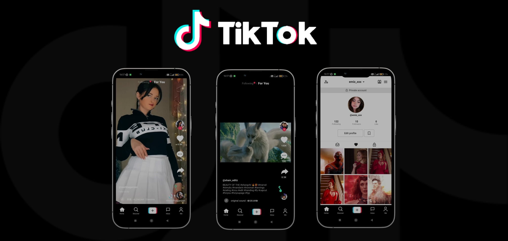

## Tiktok Mobile

## Table of Contents

- [Introduction](#introduction)
- [Features](#features)
- [Build Process](#build-process)
- [Tech Stack](#tech-stack)

 

## Introduction

TikTok, known in China as Douyin, is a short-form video hosting service owned by the Chinese company ByteDance.

This is a Tiktok mobile app which was build using flutter technology.

## Features

🚀 Play/Pause Videos

## Build Process

- Clone or download the repo
- `pub get` to install dependencies
- `flutter run` to run the application

## Tech Stack

    

## Project Goals & Outcomes

✔️ Mastering Flutter
